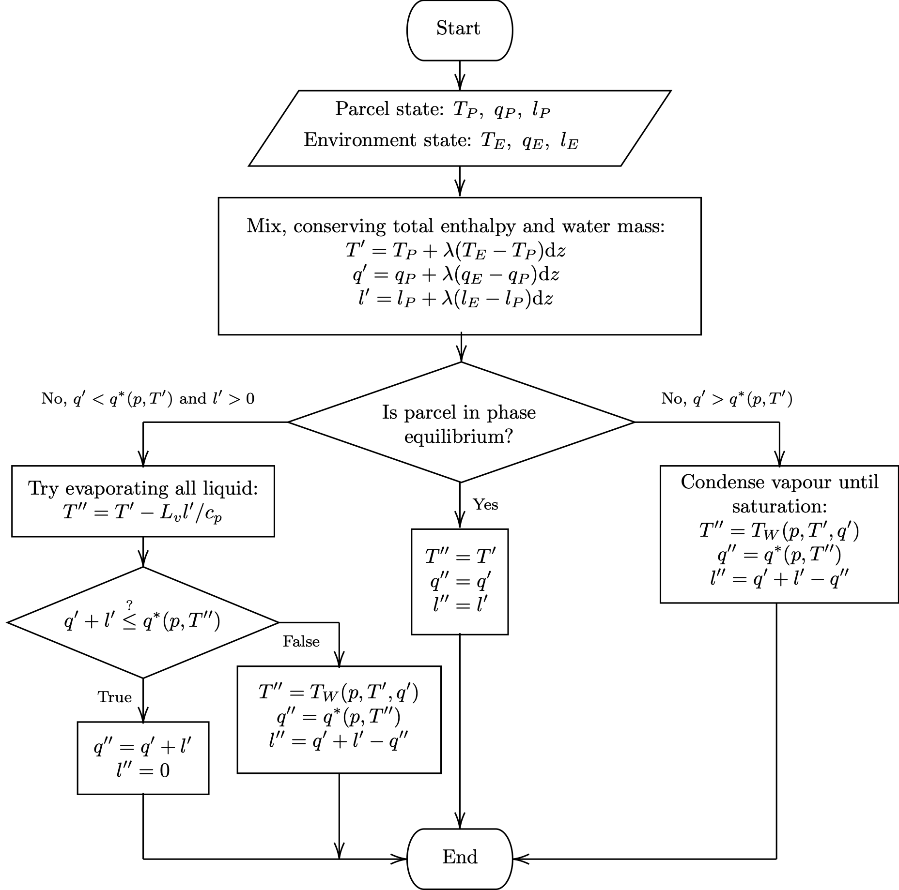
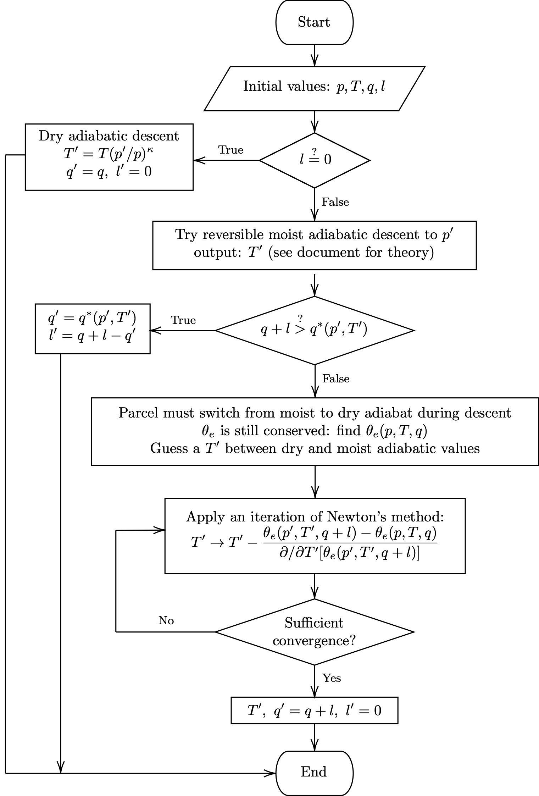
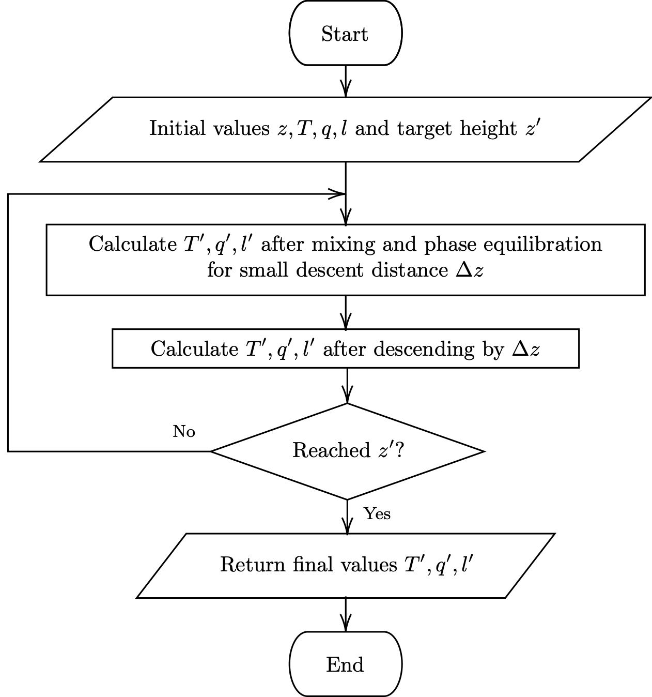

Methods
=========

General approach and code structure
-------------------------------------

All calculations were performed in Python 3.8.5. Other than
basic thermodynamic calculations (such as saturation specific humidity
from pressure and temperature, and density according to
:eq:`density` which were imported from the open-source
:code:`metpy` package [metpy]_, the model was built from
scratch and from first principles. The model is divided between
three modules, whose functions are described below.

:code:`environment.py` defines the :code:`Environment` class, which
provides utilities for finding the various environmental variables
at any height, allowing the model to be applicable to any real or
idealised atmospheric *sounding* (vertical profile of environmental
variables). The class is instantiated by supplying discrete vertical
profiles of pressure, temperature and dewpoint, and the resulting
instance offers methods that interpolate the data and calculate
derived quantities at any height. For example, the density at
5 km in an :code:`Environment` named :code:`sydney`,
initialised with a measured sounding over Sydney, is given by
:code:`sydney.density(5*units.kilometer)`.

:code:`thermo.py` provides various thermodynamic calculations that
are not available in :code:`metpy`. The following important functions are
implementations of existing published methods:

  - *Equivalent potential temperature* (a variable with
    dimensions of temperature that is conserved during moist
    adiabatic descent) as a function of pressure,
    temperature and specific humidity, following the empirical
    formula presented by [bolton_1980]_ in his Equation
    (39),
  - DCAPE and DCIN for a given atmospheric sounding, following
    the definitions of [market_et_al_2017]_,
  - The exact analytical solution for the *lifting
    condensation level* (LCL), the pressure level to which a parcel must
    be lifted in order to cool it to the point of saturation and
    the temperature at this point, adapting the implementation
    of [romps_2017]_,
  - The *wet bulb temperature* (the temperature to which
    a parcel is cooled by evaporation of water to the point of
    saturation, at constant pressure), using Normand's rule.
    Normand's rule states that if a parcel is lifted dry
    adiabaically to its LCL (which we find using the method of
    [romps_2017]_) and lowered moist adiabatically back
    to the initial level, it attains its wet bulb temperature.
  - An approximate, but faster, wet bulb temperature calculation
    implementing the method of [davies-jones_2008]_, and
  - The parcel temperature resulting from reversible adiabatic
    ascent or descent, implementing a numerical solution
    presented by [saunders_1957]_ in his Equation (3).

Additional original functions written for the model are described
in the subsections that follow.

:code:`parcel.py` defines the :code:`Parcel` class,
which assembles the functions of the other two scripts to create
the final model. It is instantiated by supplying an :code:`Environment`
instance and offers methods for calculating parcel displacement
and velocity as functions of time, given some initial conditions,
on that atmospheric sounding. These are described in detail in
the following subsections.

Temperature of an entraining, descending parcel
-------------------------------------------------

The theory of the model developed in this work is a generalisation
of the standard parcel theory in that it accounts for a parcel that
continually entrain air from its environment, exchanging heat
and liquid and/or gaseous water. Following the generally accepted
pattern common to the approaches documented by
[knupp_cotton_1985]_, the cumulative mass exchanged by
entrainment is assumed to be a linear function of distance descended,
with the constant of proportionality :math:`\lambda` termed the
*entrainment rate*. The dimension of :math:`\lambda` is inverse length;
for a parcel of mass $m$, the total mass exchanged after it descends
a distance :math:`\Delta z` is :math:`m \lambda \Delta z`. One of the main
contributions of this work is to develop a method for calculating
the temperature of a parcel that simultaneously descends and entrains
in this manner. The general approach is to divide the descent into
small vertical steps, each one consisting of a discrete entrainment
process and a short adiabatic descent.

Mixing and phase equilibration
^^^^^^^^^^^^^^^^^^^^^^^^^^^^^^^^

The first step towards finding the temperature of an entraining and
descending parcel is to find the state that results from a discrete
entrainment step, without descent. The procedure is depicted in
Figure 1 and is based on the
conservation of total enthalpy and water mass, and the requirement
that the parcel return to phase equilibrium after its exchange with
the environment (by either condensing or evaporating water). In the
cases where evaporation or condensation is necessary, we recognise
that the resulting temperature is the parcel's wet bulb temperature.

    Figure 1: flowchart for the mixing and phase equilibration calculation
    (functions :code:`mix` and :code:`equilibrate` performed at each downward
    step for the entraining downdraft.

Dry and/or reversible moist adiabatic descent
^^^^^^^^^^^^^^^^^^^^^^^^^^^^^^^^^^^^^^^^^^^^^^^

After the parcel has mixed with the environment and returned to phase
equilibrium, it descends adiabatically. The central complication in
this step is that the descent may be dry (if no liquid water is
present in the parcel), moist (if liquid water is present), or
part moist followed by part dry (if the small amount of liquid water
present fully evaporates midway during descent). If this third case
is necessary, the final temperature may be computed by recognising
that the parcel conserves its equivalent potential temperature,
and therefore finding the unique final temperature that satisfies
this requirement using numerical root-finding. Figure 2 shows all the
steps involved.

    Figure 2: flowchart for the descent calculation (:code:`descend`)
    performed at each downward step for the entraining downdraft.

Finding temperature as a function of height
^^^^^^^^^^^^^^^^^^^^^^^^^^^^^^^^^^^^^^^^^^^^^

The previous two procedures, performed one after the other, give
the state of the parcel after a small discrete downward step. A
calculation that is valid over larger distances must divide the
vertical interval into small steps (50 m was found
to give sufficient convergence by trial and error) and repeat the
discrete method at each one until the desired final height is reached.
This process is depicted in Figure \ref{fig:profile_flowchart}.

    Flowchart for the calculation of parcel temperature as a
    function of height (:code:`Parcel.profile`),
    assembling the routines shown in Figures 1 and 2.

Density, buoyancy and motion of a descending parcel
-----------------------------------------------------

Now, knowing the temperature of the parcel as a function of
height/pressure, it is a relatively simple matter to find its
density using :eq:`density` and the buoyant force per unit mass
acting on it using :eq:`buoyancy`. We then numerically solve
:eq:`ode`, expressed as the first-order system

.. math::

    \frac{\mathrm{d}}{\mathrm{d}t}
    \begin{pmatrix} z \\ w\end{pmatrix}
    = \begin{pmatrix} w \\ b(z) \end{pmatrix}.
